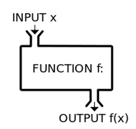

# Introduction

### Load libraries & data

Load libraries
```{r message=FALSE}
library(here) # Look where your folder begins.
```

Make two dataframes from built-in dataset, "Body Temperature Series of Two Beavers"
```{r}
beaver_1 <- beaver1
beaver_2 <- beaver2
```

## Quick intro to the `here` package
Whether they're collaborating with colleagues, uploading to data repositories after submitting a paper, or uploading scripts to Github for anyone to use, people who write code constantly share their code. **A great time-saving strategy for streamlining code-sharing is to use `here`**, a package intended to facilitate file referencing by getting rid of absolute filepaths (which makes your code fragile and difficult to integrate into other people's systems) and instead using relative filepaths (which makes your code easier to transfer to other people's systems). [See Jenny Bryan's overview of the package](https://github.com/jennybc/here_here) for more information and convincing arguments for adopting <code>here</code>.

### Where does `here` begin?
For this workshop, you've created a new R project in, for example, a folder where you keep all your R code. The folder that contains this R project is where `here` begins (aka your top-level directory).
```{r}
here::here() # this is where your folder begins.
```

### How do I change the root folder?
If you want to change your root folder, you should close your R session, move the current R project folder to the location where you want it to start, and then open a new R session, type `here::here()` again, and then the output should show you your new root location.


## What is a function?

**A function is a command that executes one to several tasks all at once**. You've probably used functions before. In R, for example, we frequently use functions that have been made by other people: <code>read.csv()</code> and <code>print()</code> are functions, to name a few.

## Why use functions?

Writing functions is a fundamental component of programming and therefore scares many people. However! Functions can be easier than you’d think. For example, think of what your perfect bar plot looks like. How much time do you spend making your bar plots look like that? Wouldn’t it be great if the very first time you plotted a barplot it looked exactly the way you wanted it to? With functions you can do that, and all the knowledge you’d need is how to make the barplot look the way you want. This workshop gives a quick overview of how to use functions to make your life easier. Demonstrations will be done in R, but are applicable to most languages.

One of the more powerful aspects of programming languages relative GUI statistical softwares is the ability to create functions. Functions are extremely powerful because they allow for the automation of repetitive tasks and reduce bloated code from the more traditional “copy-paste” format. This becomes extremely powerful when combined with the apply family or loops. However, even for simple tasks, functions can make your life easier.

## When should we make our own functions?

In a 2016 [interview with Naturally Speaking](https://naturallyspeaking.blog/2016/06/22/episode-41-conversations-with-an-r-jedi/), Hadley Wickham explains,

> "A really good rule of thumb is, as soon as you've copied and pasted something more than twice, it's time to start thinking, 'how can I get rid of that duplication?'"

So if you think it wise to take the advice of RStudio's widely regarded Chief Scientist (which I certainly do!), then you should consider making your own functions when you find yourself copying and pasting something **3 or more times.**

There will always be times to break this rule, but here's Hadley again on why it's important to learn how to write your own functions:

> "Any time you've got duplication in your code, there's just a chance for... bugs to come in because... you change one, and you forget to change another one, you get inconsistencies. It's really frustrating."


## How to set up a function

When you set up a function, the first two things you want to think about are:
  1) what you will name your function, and 
  2) the variables the function will need in order to produce an output.

Then, integrate those things into the format of function, which is fairly simple:

`functionName <- function(arguments){ arguments + operation }`

In the function below, the name is <code>add_numbers</code> and the input variables are called <code>number_1</code>, <code>number_2</code>, and <code>number_3</code>. Big surprise: it adds three numbers together!

After adding your function name and variables as in the format below (you can have lots of input variables, more than the three we're using), add a set of curly brackets. Inside the curly brackets ({}), write the chunk of code that you want your function to execute (the body). The body should reference your input variables. It should also be indented, which R will automatically do once you press "Enter" after typing the curly brackets.

```{r}
add_numbers <- function(number_1, number_2, number_3) {
  number_1 + number_2 + number_3
}
```

```{r}
add_numbers(1,10,100)
```

Take a look at how we've applied the same structuring logic to set up this function as well. This function is performing the <code>write.csv()</code> function on an object referenced as "dataframe". It will export the object to a file referenced as "filename".

I've explicitly told R that the write.csv function should use its "x" argument on what I've called "dataframe", and "file" on "filename".
```{r}
Beaver_to_csv1.1 <- function(dataframe, filename) {
  write.csv(x = dataframe,
            file = filename)
}
```

# Goal 1: Make a function that exports a dataframe to csv
In this first example, we want to export beaver csv with only filename in path. Notice we've added the file type (extension) to the filename: .csv
```{r}
# Create object that we'll use as our filename
filename1.1 <- "Beaver1.csv" 

# Use function to export dataframe object to csv
Beaver_to_csv1.1(beaver_1,
                 filename1.1)
```


## Make a function that exports any dataframe into an exports folder

We want to make a function that can take any data frame and save it with any fileformat to an export folder. First, need to create a folder that is made for all the exports of the beaver file. To begin, we first need to find where your project folder begins (its root). Then manually create a new folder in that directory called "exports".
```{r eval=FALSE}
## Make a folder especially for beaver file exports
here::here()

## Create new input variables for new function
# dir.create("./exports") ## make directory if it doesn't already exist
path1.2 <- here::here("exports")  ## make that directory 
```

Next, we make the function that exports dataframe object to csv in csvs folder.
To accommodate the file path and file type objects, we'll add a two more input variables to our new function's set of input variables.
```{r}
Beaver_to_csv1.2 <- function(dataframe, path, filetype) {
  write.csv(dataframe,
                 paste0(path, ## specify file path
                        "/", ## add slash to specify within folder
                        deparse(substitute(dataframe)), ## use the dataframe as the name 
                        filetype))
}
```

Here's what the function is doing:

1. First, look to the most indented portion of the code, which starts with <code>paste0</code>. The <code>paste0()</code> function is taking three input variables and pasting them together: path, filename, and filetype.
2. Next, look to the function encompassing that code: the <code>gsub()</code> function. This function is finding any spaces and *substituting* them with nothing (essentially removing any spaces it finds, particularly the space we had to put in the path).
3. Finally, the outermost shell is the <code>write.csv()</code> function, which is taking our dataframe as the object to be exported, and will name and export this object where the conglomerate path + filename + filetype tells it to.


## Try out the function with a few examples

Export dataframe to csv in csvs folder:
```{r}
Beaver_to_csv1.2(beaver_1, here::here("exports"), filetype=".csv")
```

Just for fun, add .txt as a file type option:
```{r}
Beaver_to_csv1.2(beaver_1, here::here("exports"), filetype=".txt")
```

We could skip the step of saving the function's input variables to individual objects and just input it all on the fly, as shown here:
```{r}
Beaver_to_csv1.2(beaver_1,
                 path = here::here("exports"),
                 filetype = ".txt")
```


## NB: Variable order matters

R will treat the variables you supply to the function in the order that the arguments appear in the function. If you have strong familiarity with the function, or if the function is fairly simple, you can simply supply the variables as done above (i.e., you don't need the "x =" portion). However, if it provides clarity or if your function is complex, you can specify each argument. This also allows you to supply arguments in different orders. 
```{r}
Beaver_to_csv1.2(filetype = ".csv", 
                 dataframe = beaver_1,
                 path = here::here("exports"))
```

Be careful here. If you supply the arguments in the wrong order and don't indicate which variables match the arguments, the function might not work. Here's an example with the basic function `lm`.

With this function, R is expecting the formula first and then the data second. You'll find that reversing those arguments does not work.
```{r eval = FALSE}
lm(beaver_1, day ~ temp) # This doesn't work
```

```{r}
lm(day ~ temp, beaver_1) # This works
```

However, if we specify that beaver_1 is the data for this linear model, it will work:
```{r}
lm(data = beaver_1, day ~ temp) # This works even though it's not in the order the function was written to expect.
```

## NB: Quoting (or not quoting) your argument matters
Sometimes functions act upon arguments that are encased in quotations marks, sometimes not. There is a difference. Be aware of this and consider this if your function is failing.
```{r eval=FALSE}
lm(data = "beaver_1", day ~ temp) # This doesn't work
```


# Goal 2: Make a function that exports a list of dataframes to separate csvs

## Make list of beaver dataframes
```{r}
Beavers <- list(beaver_1, beaver_2)
```

## Create function
```{r}
Export_beaver_list <- function(df_list, path, filetype) {
  for (i in 1:length(df_list)){
    Beaver_to_csv1.2(df_list[i], path=here::here("exports"), filetype)
  }
}
```

## Run function
```{r}
Export_beaver_list(Beavers, 
                   here::here("exports"),
                   ".csv")
```


# Goal 3: Make, export plots for multiple dataframes
## Create a function that uses a dataframe as input, then exports a plot

### Create a basic plot
```{r}
plot(beaver_1$temp ~ beaver_1$time,
     xlim = c(0, 2400),
     ylim = c(36, 38),
     xlab = "Time of Day",
     ylab = "Beaver Temperature (C)",
     col = "dark green",
     pch = 2,
     cex = .5)
```

## Make the plot more easily reproducible
One way to do so is to name relative (vs. absolute) axis limits. This plot will begin its x axis, which is plotting time, 0.5 units before the datapoint with the lowest time value. It will extend the x axis 0.5 units after the datapoint with the highest time unit. The same is true for the y axis' limits for temperature.

### Create a better, more reproducible plot
```{r}
plot(temp ~ time,
     data = beaver_1,
     xlim = c(min(time),
              max(time)),
     ylim = c(min(temp) - 0.5,
              max(temp) + 0.5),
     xlab = "Time of Day",
     ylab = "Beaver Temperature (C)",
     col = "dark green",
     pch = 2, # point shape
     cex = .5) # point size
```

### Create function
```{r}
Beaver_to_plot <- function(dataframe, path, filename, filetype) {
  
  png(file = gsub(" ", "",
                 paste0(path, filename, filetype)))
  
  plot(temp ~ time,
       data = dataframe,
       xlim = c(min(time),
                max(time)),
       ylim = c(min(temp) - 0.5,
                max(temp) + 0.5),
       xlab = "Time of Day",
       ylab = "Beaver Temperature (C)",
       col = "dark green",
       pch = 2, # point shape
       cex = .5) # point size
  
  dev.off() # tells R to stop plotting
  
}
```

### Run function
```{r}
Beaver_to_plot(beaver_1,
               here::here("./exports/ "),
               "Beaver1.1",
               ".png")
```

## Scale up: Create a function that uses a list of dataframes as input, then exports multiple plots

### Create function
```{r}
Beaver_to_plot_many <- function(df_list, path, filetype) {
  for (i in 1:length(df_list)){
    Beaver_to_plot(df_list[[i]],
                   path,
                   paste0("Beaver", i, "_plot2"),
                   filetype)
  }
}
```

### Run function
```{r}
Beaver_to_plot_many(Beavers,
                    here::here("./exports/ "),
                    ".png")
```


# Ellipsis in functions
You don't always need to specify all of the input variables for a function. Sometimes you can make use of a tool called an **ellipsis**. An ellipsis is, you guessed it, three dots in a row: "...".

The most straightforward usage of an ellipsis is for when you want to make your function flexible enough to handle an unspecified number of input variables. For instance, think about the <code>paste()</code> function.

The <code>paste()</code> function can print any number of input variables:
```{r}
paste("This", "phrase", "has", "five", "variables")
paste("How", "about", "three?")
paste("I", "could", "go", "on", "and", "on", "and", "on", "and", "on", "and", "on...")
```

## Example function with an ellipsis

```{r}
## Create function
ellipsis_example <- function(x_var, y_var, ...){
  plot(y_var ~ x_var,
       ...)
}
```

```{r}
## Run function
ellipsis_example(x_var = beaver_1$time,
                 y_var = beaver_1$temp,
                 pch = beaver_1$activ,
                 col = "magenta",
                 main = "One Beaver's Daily Temperature",
                 sub = "circles = beaver engaged in high-intensity activity",
                 xlab = "Time of Day",
                 ylab = "Temperature (C)")
```

# Extra exercises
For those interested, [here are some additional exercises](https://discdown.org/rprogramming/functions.html) crafted by Reto Stauffer, Joanna Chimiak-Opoka, Luis Miguel Rodríguez-R, Thorsten Simon, and Achim Zeileis from their resource, *"Introduction to Programming with R"*.


### Next Module

<style>
.btn {
  border: none;
  background-color: inherit;
  padding: 14px 28px;
  font-size: 16px;
  cursor: pointer;
  display: inline-block;
  color: orange;
}
.btn:hover {background: #5DADE2;}
</style>


<a class="btn" href="https://sbreitbart/BGSS_Retreat_2021_Workshop/"> Home </a>
<a class="btn" href="https://sbreitbart.github.io/BGSS_Retreat_2021_Workshop/Tips_Tricks/Tips_Tricks.html"> Tips & Tricks </a>


