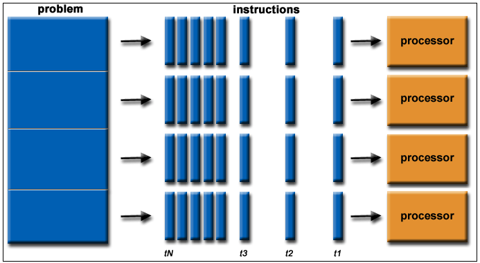

---
output:
  html_document:
    theme: sandstone
    toc: yes
    toc_depth: 3
    toc_float: yes
---
# Parallelization
  


[https://www.omnisci.com/](https://www.omnisci.com/technical-glossary/parallel-computing)
  
### Concept and terminology

Parallel computing is not unique to R and is used frequently by many programming languages and natively in your computer environment. With the widespread option of multiple core processors, parallel programming is becoming increasingly more common. At its most basic, parallel computing is **running multiple iterations of a process simultaenously (i.e., split) across multiple cores**. Essentially envision having two computers beside on another executing the task at hand. This analogy is particularly relevant because it helps frame conceptually what is going on with the computer and some of the draw backs or limitations of parallelization. 

In R, parallel computing can loosely categorized into two groups. 

1) User-specified parallel actions
2) Library-specified parallel execution
  
In the first instance, the user is doing most of the parallel work *manually*. This means identifying the processors to use, what process is to be run iteratively, how that process is to be split across cores, etc. There is some range in how specific a user choose options, but in this option, most elements need to be spelled out. Popular examples include `foreach`, `ddply`, and `parLapply`. 

In the second instance, a package has been written that allows the user to simply specify the number of cores to be used. The backend of how those cores are used has already been designed into the function either in `R` or another language (commonly C++). There are many examples, but one commonly used is `pdredge`. 

Before we dig into when to code in parallel and how to conduct it, we first need to go through some basic terminology. Unfortunately, termninology is not consistent in the parallel computing world. I am not entirely sure why this is the case, but I imagine it has something to do with different system architechs and programming languages developing their own nomenclature. For some consistency sake, I will use simplified termninology from what is provided by [Compute Canada](https://www.computecanada.ca/) and the `doParallel` package in R. 

Term   | Source | Definition
-------|--------|----------
Node   | CC     | A physical computational unit (e.g. a computer) that is comprised of cores and memory
Cluster‡| CC    | A group of interconnecting nodes
Core | CC & R   | A physical core processor with an associated set of memory (i.e. RAM)
Thread | IBM    | A virtual component meant to separate tasks
Tasks | CC      | A process that is to be executed by a core
Memory per cpu | CC     | The amount of memory (RAM) assigned to a core
Memory per node | CC    | The amount of memory (RAM) available on a node
Job  |  CC      | A submission to a super computer that requests computational resources and the tasks to be executed
Cluster‡ | R    | A virtual node generated by R comprised of multiple cores
FORK  |  R      | Fork cluster - shared memory environment across cores. Typically faster when using one node (Only available on Unix-based machines)
PSOCK  |  R      | Parallel socket cluster - Environment communicated across cores. Typically slower, but necessary when using multiple nodes (Available on both Windows and Unix machines)
‡ Super computers and high-throughput computing typically use a different definition of a *cluster* relative to R. In the computer science world it is meant to refer to multiple connected computers, but in R it is multiple connected cores. This can sometimes lead to confusion because R always uses clusters for parallel operations, but not all parallel operations on a super computer will use clusters. 

### Parallel computation in R

Let's explore a simple of example of parallel computing in R using `foreach`. This is a user-specified parallel action, and thus requires use to specify and register the cores to be used. If not unknown you should check how many cores are available on your computer. Typically it will be an even number with most computers having either 4 or 8 cores. As best practice, you should not use all your cores (typically n-1). Requesting all the computational resources will make your computer to struggle to operate programs outside of R (e.g. the OS, Chrome, Word) and the computer can crash or freeze. 

```{r warning=F, message=F}
library(doParallel)
library(foreach)

## Check the number of cores
detectCores()

## Set up cluster and the number of cores to be used 
cl <- makeCluster(4, type="PSOCK") ## specify number of cores, and type of cluster (PSOCK or FORK)
registerDoParallel(cl) ## register the backend into a virtual node

## Execute parallel operation
outLoop <- foreach(i = 1:5, .combine=c) %dopar% {
  print(i)
}
outLoop
```

The syntax with `foreach` shares commonality with `for` loops, but there are some notable differences. The first nuance, is that the specification of iterations requires an `=` sign rather than an `in` call. The next is the `%dopar%` operator. This is what commands the loop to run in parallel rather than sequentially. The `foreach` function can be executed in series simply by using `%do%` in place of `%dopar%`. The other difference is that `foreach` has many arguments that can be specified, all prefaced by a period. The argument we use here is the `.combine` which specifies how the outputs from each loop iteration are to be collated into the final object. This is particularly useful because it doesn't require setting up an empty dataframe to fill (as we did with for loops). 

Another commonly used argument is `.errorhandling` to decide what happens when an error occurs in the iteration. Similar to the `next` and `tryCatch` usage in for each, arguments can be specified here including `remove` or `pass` to continue the loop without the error. 

Let's look at a more complicated example and see the difference in run time. 

```{r message=F}
### Load penguin data
library(palmerpenguins)
penguins <- penguins[!is.na(penguins$body_mass_g),]
penguins <- data.frame(penguins) ## drop NAs and convert to  data.frame

## list species
speciesNames <- c("Adelie","Chinstrap","Gentoo")

## Set up cluster and the number of cores to be used 
cl <- makeCluster(4, type="PSOCK") ## specify number of cores, and type of cluster (PSOCK or FORK)
registerDoParallel(cl) ## register the backend into a virtual node

### Conduct in parallel
outCor <- foreach(i = 1:10000,  .combine=c) %dopar% {
bootDF <- penguins[sample(nrow(penguins), 100, replace=T),]
corVal <- cor(bootDF$bill_length_mm, bootDF$bill_depth_mm, use="complete.obs") ##conduct correlation
corVal
}
outCor[1:5]

## Test the timing
system.time(
outCor <- foreach(i = 1:10000,  .combine=c) %dopar% {
bootDF <- penguins[sample(nrow(penguins), 100, replace=T),]
corVal <- cor(bootDF$bill_length_mm, bootDF$bill_depth_mm, use="complete.obs") ##conduct correlation
corVal
}
)

```

One of the larger challenges with R and parallel computing is managing the environment workspace to the separate cores. Every object and package needs to be exported separetly for the operation to work in parallel. The particularly tricky part about this, there is often no error message provided. The code will simply be executed slowly in sequential order rather than parallel. 

It is good practice to export the environment and dataframes to each of the respective cores. While this may work on your personal computer, it will not always work and will infrequently run in parallel properly on a super computer. This is also true for exporting libraries. Let's take a look at what an error might look without specifying a package

```{r}
library(broom)


## Set up cluster and the number of cores to be used 
cl <- makeCluster(4, type="PSOCK") ## specify number of cores, and type of cluster (PSOCK or FORK)
registerDoParallel(cl) ## register the backend into a virtual node
clusterExport(cl, varlist=list("penguins")) ## export the dataframe to each core


outCor <- foreach(i = 1:1000,  .combine=rbind) %dopar% { ## combine dataframe of all linear models
bootDF <- penguins[sample(nrow(penguins), 100, replace=T),]
mi <- lm(bill_length_mm ~  bill_depth_mm, data=bootDF) ## conduct linear model
broom::tidy(mi) ## clean up output of linear models
}

## This can be solved by assigning the library to pull from or by specifying the library as an argument

outCor <- foreach(i = 1:1000,  .combine=rbind, .packages=c("broom")) %dopar% { ## combine dataframe of all linear models
bootDF <- penguins[sample(nrow(penguins), 100, replace=T),]
mi <- lm(bill_length_mm ~  bill_depth_mm, data=bootDF) ## conduct linear model
tidy(mi) ## clean up output of linear models
}

```


### Theory


