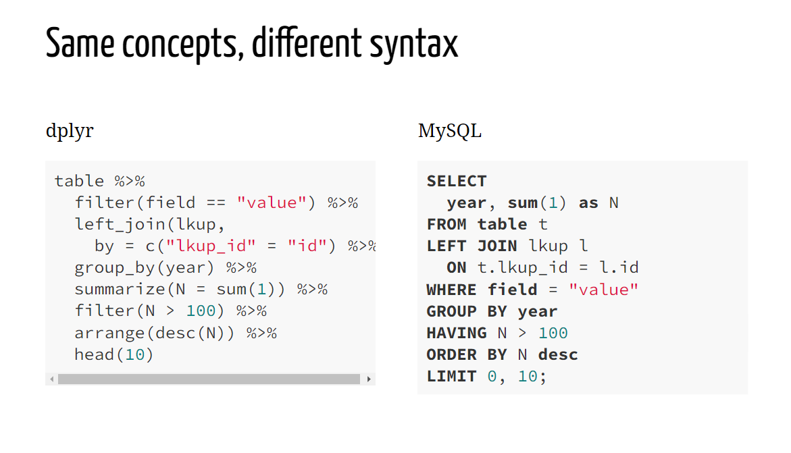

*Estimated lesson teaching time: 20 minutes*

*Assumed background knowledge: Basic dplyr commands, how to use* `magrittr` *pipes (*`%>%`*)*

# Overview

## What is SQL?

Many of us are accustomed to producing our own data or downloading it from repositories, saving it to a folder on our local machines, and then analyzing it in a program like RStudio. However, sometimes it's not possible or practical to store data on a local drive, such as if it is very large or of a sensitive nature. In cases like this, it's better to store the data on a remote server and obtain the information we need by *querying* (retrieving specific information from) the dataset, rather than downloading the entire thing and working with it locally. A commonly-used language for querying databases is called SQL, pronounced "S-Q-L" or "sequel". It stands for "Structured Query Language".

## Why are we including an introduction to SQL?

A few reasons:

-   SQL proficiency is frequently cited as a sought-after skill in many fields, including data science. It's safe to say that knowing SQL is typically a very helpful asset when entering data science.

-   Though we can't provide a comprehensive introduction to SQL, we thought it'd be helpful to offer a little motivation to learn more and a small push to help get you started.

-   Many academic ecologists are used to collecting their own data and storing it locally. This lesson will help acquaint you with practices frequently used in industry, where it is much more common to work with data stored in remote databases.

**Important aside:** Data science is an exceptionally diverse field that is impossible to describe with just a few sentences and includes highly valued workers who do not use SQL regularly.

## What's my secret weapon?

Yes, you! When it comes to learning SQL, your secret weapon is this:

> If you are an R user familiar with `dplyr`, you already know the basics of SQL!

[](https://beanumber.github.io/sds192/)

SQL has been around for decades (since the 70s). `dplyr` is an R package launched in 2014 whose grammar is based on SQL syntax.

# Basics of SQL for R Users

We have 3 goals for today's lesson:

1.  Set up coding environment to query SQL databases with R
2.  Learn basic similarities and differences between SQL and `dplyr` syntax
3.  Practice translating `dplyr` to SQL and vice versa

By accomplishing these goals, we hope to give you enough confidence to continue learning SQL and better prepare yourself for a career involving data science.

*Note: This lesson was structured similarly to the [Data Carpentry "SQL and R Databases" lesson](https://datacarpentry.org/R-ecology-lesson/05-r-and-databases.html) but is shorter and designed for our specific attendee group.*

## Set up workspace

### Install packages

```{r eval=FALSE}
install.packages(c("dplyr", "dbplyr", "RSQLite", "magrittr"))
```

### Load libraries

```{r warning=FALSE, message=FALSE}
library("dplyr")
library("dbplyr")
library("RSQLite")
library("magrittr")
```

### Connect to database

First, create a new folder in your home directory called "data_raw". Then, download the SQLite database. Finally, connect with the database and name it "mammals". *Remember that we are not downloading the data; instead, we are downloading a link to the SQLite database (*`portal_mammals.sqlite`*) and instructing R how to access it remotely.*

```{r}
# create raw data folder
dir.create("data_raw",
           showWarnings = FALSE)

# download sqlite database
download.file(url = "https://ndownloader.figshare.com/files/2292171",
              destfile = "data_raw/portal_mammals.sqlite",
              mode = "wb")

# access the database and name it "mammals"
mammals <- DBI::dbConnect(
  RSQLite::SQLite(),
  "data_raw/portal_mammals.sqlite")
```

*Hold up. What is going on in that last line of code?*

-   `dbConnect` is a function from the `DBI` package. We're using it to send R commands to our database and can interface with lots of databases regardless of the management system (e.g. MySQL, PostgreSQL, BigQuery, etc.)

-   The `SQLite` function from the `RSQLite` package lets us R users interface with SQLite databases specifically. We are telling R to connect to the `portal_mammals.sqlite` database.

## Explore the data

First, let's see what our data looks like.

```{r}
src_dbi(mammals)
```

We see that this database contains three tables: plots, species, and surveys. Let's take a closer look at the surveys table.

```{r}
surveys <- tbl(mammals, "surveys")
print(surveys)
```

The first line of the output imparts an important lesson: **R tries to be as lazy as possible when interfacing with databases.** For instance, this simple command does not tell us the dimensions of the surveys table. The length is unknown ("??") but the width = 9 columns. Unless we ask it for the length specifically, it will not tell us because R did not actually view the entire table when fetching the first 10 rows for us.

The table itself looks similar to what we're used to manipulating in R as data frames. There are at least 10 rows and several columns, including "record_id", "month", and "day". This table contains information about mammals observed in different plots over several years.

## Query the data

Let's start wrangling the data and ask: how many males were observed in 1978 in plot 2?

> Challenge: convert this question into a dplyr command. (To see the answer, press the "CODE" button on the right side of the page).

```{r class.source = 'fold-hide'}
surveys %>%
  filter(sex == "M",
         year == "1978",
         plot_id == "2") %>%
  count() # there are 52 individuals.
```

As you can see, querying the surveys table with a question like this isn't really any different than working with an R data frame!

### Save subset to R environment

If you want to save a subset of a table as a new object, then take note of a few differences when working with SQL databases.

Specifically, we need to add one more line of code to tell our **lazy bones of an R interface to finish the command.**

Example: ask R to save a subset of the surveys table that 1) includes data from 1998-2000 and 2) counts up the number of species seen per year.

```{r}
annual_species <- surveys %>%
  filter(year == "1998", "1999", "2000") %>%
  group_by(year, species_id) %>%
  summarise(n = n()) %>%
  collect() # <-  don't forget this command!
```

Specifically, the `collect()` command is essential for telling R that we're done creating a query and are ready to implement it.

Notice the change in data structure if we do not include the `collect()` command:

```{r}
annual_species_notcollected <- surveys %>%
  filter(year == "1998", "1999", "2000") %>%
  group_by(year, species_id) %>%
  summarise(n = n())

class(annual_species_notcollected)
class(annual_species)
```

-   `annual_species_notcollected` is not a data frame.

-   `annual_species`is a data frame.

## Translate dplyr syntax to SQL

A simple way to translate your `dplyr` syntax to SQL syntax is to pipe in the `show_query()` function.

::: {style="display: grid; grid-template-columns: 1fr 1fr; grid-column-gap: 10px; "}
<div>

**Translated R --\> SQL syntax**

```{r message=FALSE}
annual_species_notcollected %>%
  show_query()
```

</div>

<div>

**Original R syntax**

```{r eval=FALSE, message=FALSE}
annual_species_notcollected <- surveys %>%
  filter(year == "1998", "1999", "2000") %>%
  group_by(year, species_id) %>%
  summarise(n = n())
```

</div>
:::

> Notice: How does the original R code compare to the translated SQL syntax?

This tool is very handy for learning SQL, but practitioners recommend learning at least basic SQL syntax when getting into data science. Another reason why? So that you can read, in addition to write, SQL.

## Challenge

### SQL to R

Translate this SQL query into R code. [Click here for a straightforward SQL cheat sheet](https://learnsql.com/blog/sql-basics-cheat-sheet/) and [a dplyr cheat sheet](https://github.com/rstudio/cheatsheets/blob/main/data-transformation.pdf) to help get you started. Remember to unhide the correct translation by clicking the "CODE" button below the SQL syntax section.

**SQL syntax**

SELECT \*

FROM (SELECT `record_id`, `hindfoot_length`

FROM `surveys`)

WHERE (`hindfoot_length` \> 20.0)

<br>

**R syntax translated:**

```{r eval = FALSE, class.source = 'fold-hide'}
surveys %>%
  select(record_id, hindfoot_length) %>%
  filter(hindfoot_length > 20)
```

### R to SQL

Translate this `dplyr` code into an SQL query by filling in the blanks. Remember to unhide the correct translation by clicking the "CODE" button below the SQL syntax section.

**R syntax**

```{r eval = FALSE}
surveys %>%
  filter(year > 1977 & year < 2000) %>%
  filter(hindfoot_length == 30) %>%
  arrange(desc(species_id))

```

::: {style="display: grid; grid-template-columns: 1fr 1fr; grid-column-gap: 10px; "}
<div>

**SQL syntax**

SELECT \*

FROM (SELECT \*

FROM \_\_\_\_

WHERE (`year` \> 1977.0 \_\_\_\_ `year` \< 2000.0))

\_\_\_\_ (`hindfoot_length` = 30.0)

ORDER BY `species_id` \_\_\_\_

</div>

<div>

> HINT: *For a word bank of possible SQL terms, click the "CODE" button directly below &darr;*

```{r eval=FALSE, class.source = 'fold-hide'}
AND
DESC
`surveys`
WHERE
```

</div>
:::

<br>

**SQL syntax translated:**

```{r class.source = 'fold-hide'}
# double asterisks around words (e.g. **example**) indicate correct fill-in-the-blank answers.


# <SQL>
# SELECT *
# FROM (SELECT *
# FROM **`surveys`**
# WHERE (`year` > 1977.0 **AND** `year` < 2000.0))
# **WHERE** (`hindfoot_length` = 30.0)
# ORDER BY `species_id` **DESC**
```

# Next steps

Here are some resources to help you continue on your SQL-learning path.

1.  Stretch your skills further with Ethan White and Zachary Brym's excellent ["Integrating R and SQL" assignment](https://rsh249.github.io/semester-biology/assignments/r-sql/).
2.  Work through [the Carpentries' "SQL Databases and R" lesson](https://datacarpentry.org/R-ecology-lesson/05-r-and-databases.html). This great lesson instructs learners how to join tables- an exceptionally important skill for any SQL user- among other essential tasks.
3.  Dive deeper into the [`dbplyr` package](https://dbplyr.tidyverse.org/index.html)'s documentation to learn more about interfacing with SQL databases using R.

```{=html}
<style>
.btn {
  border: none;
  background-color: inherit;
  padding: 14px 28px;
  font-size: 16px;
  cursor: pointer;
  display: inline-block;
  color: orange;
}
.btn:hover {background: #5DADE2;}
</style>
```
<a class="btn" href="https://sbreitbart.github.io/SQL_tutorial/"> Home </a>
