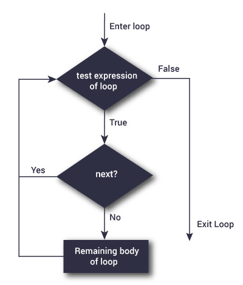

# For Loops
  

  
### To vectorize or not to vectorize
  
*N.B.* **Start with a new R project**

### Basics

The concept of a `for` loop is something pervsaive across many programming languages. Packages and vectorization are generally optimized versions `for` loops that are executed in a more efficient programming language such as C++. However, R still allows utilization of `for` loops. 

When I was first getting started trying to iterate through many tasks, I found `for` loops relatively inutitive compared to some other methods such as vectorization. I believe the greater understandability has to do with the structure. A `for` loop, similar to a function, is a task completed normally but then with one variable that changes, which allows the iterations. Let's take a look at an example of what that might look like getting the correlation between variables among some groups. 

We are going to use the [penguin dataset by Allison Horst](https://allisonhorst.github.io/palmerpenguins/).

```{r warning=F, message=F}
library(palmerpenguins)
penguins <- penguins[!is.na(penguins$body_mass_g),]
penguins <- data.frame(penguins) ## drop NAs and convert to  data.frame
str(penguins)


### separate linear models for each species
adelie <- subset(penguins, species=="Adelie")
corAde <- cor(adelie$bill_length_mm, adelie$bill_depth_mm, use="complete.obs")
chinstrap <- subset(penguins, species=="Chinstrap")
corchin <- cor(chinstrap$bill_length_mm, chinstrap$bill_depth_mm, use="complete.obs")
gentoo <- subset(penguins, species=="Gentoo")
corGen <- cor(gentoo$bill_length_mm, gentoo$bill_depth_mm, use="complete.obs")
penguinDF <- data.frame(species=c("Adelie","Chinstrap","Gentoo"), 
                        corValue =c(corAde,corchin,corGen) )

```

The above approach has a few issues with it. Besides being labour intensive, the copy-paste of multiple lines runs of the risk of an error appearing. The person analyzing this data might miss an argument, such as the `use` arguement, or might misspell one of the target species they are analyzing. Without an error message produced by R, there is no way to determine that an error was made along the way. Most importantly, this strategy does not scale easily. For three species, it is annoying, for 1000 species it is impractical. 

We can iterate through these same operations using a `for` loop with less code and less potential of errors. First let's take a look at the basics of what the `for` loop syntax is. At the beginning of the loop you specify the character to iterate through and what values you want them to be assigned. Here list the numbers 1 through 5 by printing the iterating value of i. 

```{r}
for(i in 1:5){
  print(i)
}

```

We can extend this logic to our previous example of subsetting and correlations. Copying down the same syntax from the correlation example, we create a generic dataframe that will be written over each iteration. The important difference here is that as the loop works it will continue to write over objects. We will need to specify a value that comes out so that we get a value for each iteration. 

```{r}

## list species
speciesNames <- c("Adelie","Chinstrap","Gentoo")

## Empty vector to fill
outCor <- c()

for(i in 1:3){
tempPenguin <- subset(penguins, species==speciesNames[i]) ## subset species by that iteration
corVal <- cor(tempPenguin$bill_length_mm, tempPenguin$bill_depth_mm, use="complete.obs") ##conduct correlation
outCor <- c(outCor,corVal) ## join empty vector with new cor value
}
outCor

```

While it is common to use a number to iterate through, you can also use characters or factors like we have in this example. There are some instances where this would be preferable. 

```{r}

## Empty vector to fill
outCor <- c()

for(i in c("Adelie","Chinstrap","Gentoo")){
tempPenguin <- subset(penguins, species== i ) ## subset species by that iteration
corVal <- cor(tempPenguin$bill_length_mm, tempPenguin$bill_depth_mm, use="complete.obs") ##conduct correlation
outCor <- c(outCor,corVal) ## join empty vector with new cor value
}
outCor

```

Let's take a look at another example but with linear models where we extract the co-efficients from those models.

```{r}
## Empty data.frame to fill
coefout <- data.frame()

for(i in c("Adelie","Chinstrap","Gentoo")){
model <- lm(flipper_length_mm ~ body_mass_g, data= penguins, species == i )
dfTemp <- data.frame(species= i, 
                      coefficient = coef(model)[2],
                      intercept = coef(model)[2])
coefout <- rbind(coefout,dfTemp)
}
coefout
```

It is also possible to nest `for` loops within one another. Nested for loops are more common and more efficient in other programming languages. However, they are still possible in R and have their utility. We can repeat the above example using another subset. 

```{r}
## Empty data.frame to fill
coefout <- data.frame()

for(i in c("Adelie","Chinstrap","Gentoo")){
  for(j in 2007:2009){
    
model <- lm(flipper_length_mm ~ body_mass_g, data= penguins, species == i & year == j )
dfTemp <- data.frame(species= i, 
                     year = j,
                      coefficient = coef(model)[2],
                      intercept = coef(model)[2])
coefout <- rbind(coefout,dfTemp)
  }
}
coefout
```

Here the sky is the limit. Really, anything you can do once, can be set to run infinitely using for loops. The vectors supplied to `i` or `j` can be hundreds, thousands, or longer. You can have multiple nestings within one another. Our examples here use dataframes and vectors, but all this could be repeated with rasters, plots, graphics, or any object loaded into R. There are many, many options. This is where I believe the `for` loop has its greatest strength. Using this formula, anything that can be loaded into R can be replicated this way. 

### Formula in designing `for loops`

There is a formula that I try and follow. The formula is as follows:

1. Create a object to receive exports from the loop.
2. Specify a vector to change (either a number to iterate through or specific elements)
3. Run the operation (remember most objects in this section will be constantly written over each iteration)
4. Export needed elements to external object


Let's try that formula with some plots
```{r}

par(mfrow=c(3,3))
for(i in 1:3){
  for(j in 1:3){
  tempdf <- rnorm(1000, mean= i, sd = j )
  hist(tempdf, main=paste0("Mean = ",i," & SD = ",j))
  }
}


```

Next, we are going to look at troubleshooting some problems in `for` loops. The most common error that will arise is that one iteration will break. This can arise for a number of reasons, but typically involves an error message in a function that prevents completion of the loop, such as the example below. 


```{r eval=F}

par(mfrow=c(1,3))
for(i in 2006:2008){
  m1 <- lm(bill_length_mm ~ body_mass_g, data=penguins, year==i)
  hist(residuals(m1))
}

```

### Troubleshooting loops

Troubleshooting is the next logical step. However, there can often be times you want the entire loop to complete because either a) the errors can be skipped, or b) all errors need to be identified to properly troubleshoot. We will explore `next` for *a* and `TryCatch` for *b*. There is also the `break` function for those looking to exit the loop specifically at the error to try and resolve it. 



Flowcharts curtosy of [www.datamentor.io](www.datamentor.io)

```{r}
## Loop without conditional next
valOut <- c() ## empty vector
for (i in 0:5){
  tempVal <- log(i) 
  valOut <- c(valOut,tempVal)
}
valOut ## output


## Adding in next statement
valOut <- c()
for (i in 0:5){
  tempVal <- log(i) 
  if(is.infinite(tempVal)) { ## test expression of the loop
  next ## skip remainder of loop if test is true
  }
  valOut <- c(valOut,tempVal)
}
valOut
```

While `next` is good for pushing through on conditions, it is less helpful when it comes to errors. That is where `tryCatch` comes in. `tryCatch` will allow the loop to continue through and has the helpful option of outputting an error message. Let's apply it to the above example with the linear model. 

```{r}

par(mfrow=c(1,3))
for(i in 2006:2008){
  tryCatch({ ## wrap the entire loop in a Try catch
  m1 <- lm(bill_length_mm ~ body_mass_g, data=penguins, year==i)
  hist(residuals(m1))
  }, error = function(e) print(i)) ## specify what occurs with an error messagge
}

```

Here we specify which iteration of the loop causes an error to occupy. Importantly, the iterations that are without error are still produced. These are all effective at trying to resolve bugs and troubleshoot errors in complex loops or massive iterations. There is also no limit to the applicatino of `tryCatch`. Multiple `tryCatch` conditions can be implemement at different stages of particularly long loops. This allows for the identification of errors at different points. 

While we have showed the application of `tryCatch` for loops, its has an equally important role in functions. Using the same syntax and error identification, one can use `tryCatch` to develop functions that provide useful error messages. 


### Practice using `for` loops

Let's practice writing `for` loops!

**Ex1.** For our first prompt, your task is to fix this faulty for loop:
```{r}

## Create output dataframe
outDF <- data.frame()

for(i in c(4,6,8)){
  m1 <- lm(mpg ~ hp, data=mtcars, cyl==i) ## linear model through mtcars dataset for each cylinder type
  results <- data.frame(anova(m1)) ## extract model co-efficients
  results[,"cyl"] <- i
  outDF <- rbind(results)
}
outDF


```

<details><summary>Answer Ex.1</summary>


```{r eval=T}
## Create output dataframe
outDF <- data.frame()

for(i in c(4,6,8)){
  m1 <- lm(mpg ~ hp, data=mtcars, cyl==i) ## linear model through mtcars dataset for each cylinder type
  results <- data.frame(anova(m1)) ## extract model co-efficients
  results[,"cyl"] <- i
  outDF <- rbind(outDF, results) ## NEEDED TO ADD BIND TO OUTPUT DF
}
outDF
```
</details>

<br>

**Ex2.** Using the `mtcars` dataset, write a for loop that conducts ANOVAs testing for differences in miles per gallon (mpg) for cylinder type, gear, and am. 
*hint: the `aov` function does not inherently accept character vectors.  

```{r}
## Create output dataframe
anovaOut <- data.frame()

for(i in c("cyl","gear","am")){
 i 
}
```

<details><summary>Answer Ex.2</summary>
```{r eval=T}
for(i in c("cyl","gear","am")){
 predictor <- as.factor( mtcars[,i])
 m1 <- aov(mpg ~ predictor, data=mtcars)
 print(summary(m1))
}
```
</details>

<br>

**Ex3.** Lastly, check for normality among the residuals of the loop we created above using the Shapiro-Wilks test `shapiro.test`:
```{r}
for(i in 2007:2009){
  m1 <- lm(bill_length_mm ~ body_mass_g, data=penguins, year==i)
  
}
```

<details><summary>Answer Ex.3</summary>
```{r eval=T}
for(i in 2007:2009){
  m1 <- lm(bill_length_mm ~ body_mass_g, data=penguins, year==i)
  shap1 <- shapiro.test(residuals(m1))
  print(shap1)
}
```
</details>

<br>


#### Next Module

<style>
.btn {
  border: none;
  background-color: inherit;
  padding: 14px 28px;
  font-size: 16px;
  cursor: pointer;
  display: inline-block;
  color: orange;
}
.btn:hover {background: #5DADE2;}
</style>


<a class="btn" href="https://afilazzola.github.io/FastR/"> Home </a>
<a class="btn" href="https://afilazzola.github.io/FastR/Vectorization/vectorization.html"> Vectorization </a>
