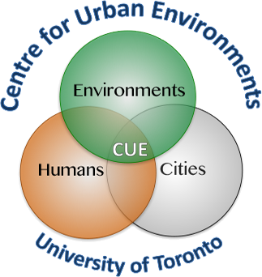

## Instructors

- [Alessandro Filazzola](http://www.filazzola.info) 
- [Sophie Breitbart](https://sophiebreitbart.wordpress.com/)

## General Information

The first few years of grad school are a whirlwind, let alone the initial months! Coding is a skill that's increasingly important for most graduate students in ecology & evolutionary biology, yet without formal instruction (who has time for that?), many of us end up learning enough to get by with an ad hoc approach (hello, stackoverflow). **Winging it is good for some situations, but sometimes it's worth it to learn skills that will increase your long-term efficiency and reproducibility** (and, oftentimes, short-term too!) Example A: copying/pasting chunks of code might seem faster, but over time, this practice can make you vulnerable to errors, long analysis times, and difficulty sharing your code with others.

**The purpose of today's workshop is to give you the skills to write your own functions so that you can streamline your data analysis workflow.** We will also describe some tools that we believe are well-worth getting to know, especially for those who are still in the early stages of coding.

This workshop will involve a combination of lecture and hands-on activities. A basic understanding of R is recommended because it will make the content more relevant and understandable, but even novices can listen and learn about the general concepts behind functions. Participants should use a computer with R already install using Mac, Linux, or Windows operating system (not a tablet, Chromebook, etc.). 

**Who**: The course is aimed at new and intermediate learners of R.

**When**: November 23, 2021 @ 9:00 EDT

**Where**: Virtual. [https://utoronto.zoom.us/j/85097717914](https://utoronto.zoom.us/j/87969106726)
Meeting ID: 879 6910 6726
Passcode: functions

**Requirements**: Participants should use a laptop with a Mac, Linux, or Windows operating system (not a tablet, Chromebook, etc.) with administrative privileges. Ideally, two screens would be beneficial to see the video and your workstation at the same time. However, participation is not necessary and you can simply follow along as we demonstrate. 

**Contact**: Please contact alex.filazzola@outlook.com for more information.

**Notes**: [Live Notepad](https://etherpad.wikimedia.org/p/SORTEE-FastR)


## Schedule 
(time in EDT)


Time   | Goal
-------|------------
9:00 | Introduction and set-up
9:10 | [Functions](Functions/Functions.html)
9:45 | Break & Practice
10:00 | [Tips & Tricks](Tips_Tricks/Tips_Tricks.html)
10:25 | Wrap up

**Past events**: We have previous run this workshop at [SORTEE 2021](https://www.sortee.org/events/) and [CSEE 2021](https://csee-scee2021.ca/). 

## Software

[R](http://www.r-project.org/) is a programming language that is especially powerful for data exploration, visualization, and statistical analysis. To interact with R, we use [RStudio](http://www.rstudio.com/).


Windows        |   Mac OS  X   |      Linux
---------------|---------------|---------------
Install R by downloading and running [this .exe](http://cran.r-project.org/bin/windows/base/release.htm) file from [CRAN](http://cran.r-project.org/index.html). Please also install the [RStudio IDE](http://www.rstudio.com/ide/download/desktop).| Install R by downloading and running [this .pkg](http://cran.r-project.org/bin/macosx/R-latest.pkg) file from [CRAN](http://cran.r-project.org/index.html). Please also install the [RStudio IDE](http://www.rstudio.com/ide/download/desktop).|You can download the binary files for your distribution from [CRAN](http://cran.r-project.org/index.html). Please also install the [RStudio IDE](http://www.rstudio.com/ide/download/desktop)

**Packages we will be using:** We recommend you install these ahead of time and ensure they load correctly to reduce troubleshooting in the workshop. 
```{r eval= FALSE}
install.packages(c("here))

```


## Other workshops

If you enjoyed this workshop and were interested in learning more, we have also run workshops on

  * [How to improve the reproducibility and efficiency of your coding for ecology and evolution (FastR)](https://github.com/afilazzola/FastR)

Additionally, Alex has run these workshops:

  * [Logistic Regression](https://github.com/afilazzola/CUELogisticRegression)
  * [Introduction to Ecological Analyses](https://afilazzola.github.io/UoA.CommunityAnalyses.2018/)
  * [Introduction to Functions](https://afilazzola.github.io/Intro2Functions/)

You can find similar style workshops, usually that are longer and go into more detail, with [The Carpentries](https://carpentries.org/workshops-curricula/). They have teachers available globally and cover all forms of programming beyond R. 

<br>

## Thank You!

<br>

 Center for Urban Environments         |  University of Toronto
:-------------------------------------:|:-------------------------:
                |  
 
